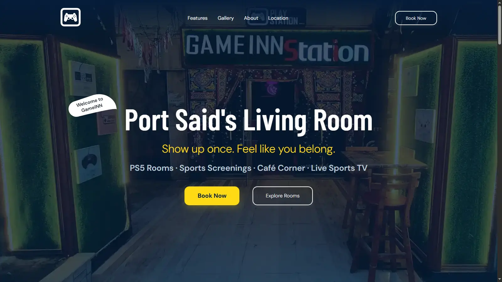

# 🎮 GameINN

A modern gaming landing page designed in Figma and implemented using HTML, CSS, and JavaScript.

This project focuses on turning a real UI design into a fully responsive and interactive website.

---

## 📸 Design

The UI was first designed in **Figma**, then converted into code to ensure pixel-perfect implementation.

---

## 🚀 Live Demo

https://gameinn-station.netlify.app

---

## 📸 Preview



---
## 🧰 Technologies


## ✨ Features

- Fully responsive design (mobile, tablet, desktop)
- Pixel-perfect implementation from Figma
- Smooth scrolling experience
- Interactive carousel system
- Clean and modern UI
- Optimized images (WebP format)
- SEO-friendly structure
- Open Graph support for social sharing

---

## 🛠️ Tech Stack

- HTML5
- CSS3
- JavaScript (ES6)
- Figma (UI/UX Design)

---

## 📁 Project Structure

```
GameINN
│
├── assets/
│   ├── images/
│   ├── JS/
│   └── style/
│
├── index.html
└── README.md
```

---

## 🎯 What I Learned

- Translating Figma designs into real code
- Building responsive layouts from scratch
- Improving DOM manipulation in JavaScript
- Managing UI interactions (carousel, navigation)
- Writing cleaner and more structured CSS

---

## 📈 Future Improvements

- Improve accessibility (ARIA labels + keyboard navigation)
- Add loading states for images
- Enhance animations and micro-interactions
- Improve carousel performance and UX
- Refactor JavaScript into modular structure

---

## 📦 Installation

```bash
git clone https://github.com/MaX-saNAD/GameINN.git
cd GameINN
```

Then open:

```
index.html
```

or use **Live Server**.

---

## 👨‍💻 Author

**Max Sanad**

GitHub: https://github.com/MaX-saNAD